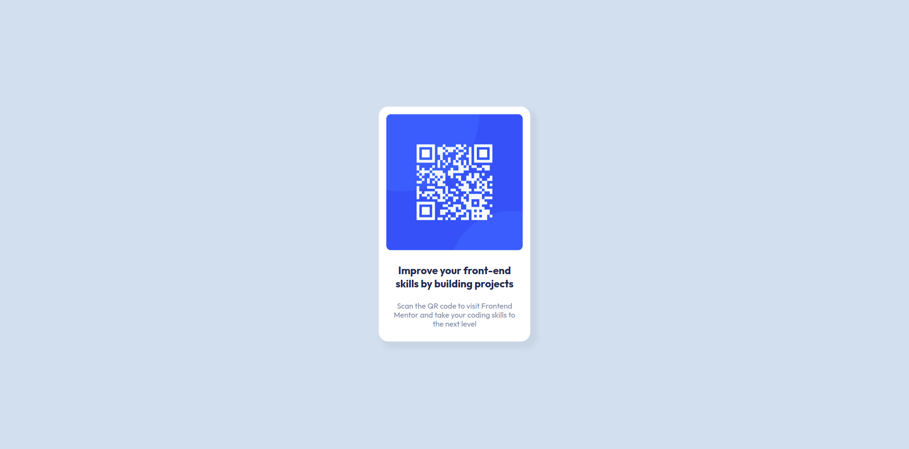

# Frontend Mentor - QR code component solution

This is a solution to the [QR code component challenge on Frontend Mentor](https://www.frontendmentor.io/challenges/qr-code-component-iux_sIO_H). Frontend Mentor challenges help you improve your coding skills by building realistic projects. 

## Table of contents

- [Overview](#overview)
  - [Screenshot](#screenshot)
  - [Links](#links)
- [My process](#my-process)
  - [Built with](#built-with)
  - [What I learned](#what-i-learned)
  - [Continued development](#continued-development)
  - [Useful resources](#useful-resources)
- [Author](#author)
- [Acknowledgments](#acknowledgments)


## Overview

### Screenshot
**Desktop**


**Mobile**


### Links
- Live Site URL: [GitHub Pages](https://paul21777.github.io/https-www.frontendmentor.io-challenges-qr-code-component-iux_sIO_H-hub-qr-code-component-TxenrPnki/)

## My process

### Built with

- Semantic HTML5 markup
- CSS properties


### What I learned
 I learned about integrating a Figma Design.
 
 Learn about box-shadows
 ```css
 box-shadow: 10px 10px 10px 5px rgba(0, 0, 0, 0.05);
 ```

Learn about how to center vertically an element (work only if there is one single element in the page)
```css
	margin-top: 50vh; /* poussé de la moitié de hauteur de viewport */
	
	transform: translateY(-50%); /* tiré de la moitié de sa propre hauteur */
```
### Continued development
- Would like to learn about [CSS custom properties](https://developer.mozilla.org/fr/docs/Web/CSS/Using_CSS_custom_properties)and use them in my projects
- [How to vertically center an element](https://www.alsacreations.com/tuto/lire/1032-comment-centrer-verticalement-sur-tous-les-navigateurs.html)


### Useful resources
[How to vertically center an element](https://www.alsacreations.com/tuto/lire/1032-comment-centrer-verticalement-sur-tous-les-navigateurs.html)


## Author
- Frontend Mentor - [@Paul21777](https://www.frontendmentor.io/profile/Paul21777)


## Acknowledgments

Thanks to [Clément Creusat](https://www.frontendmentor.io/profile/ccreusat) for his suggestion of improvements.
